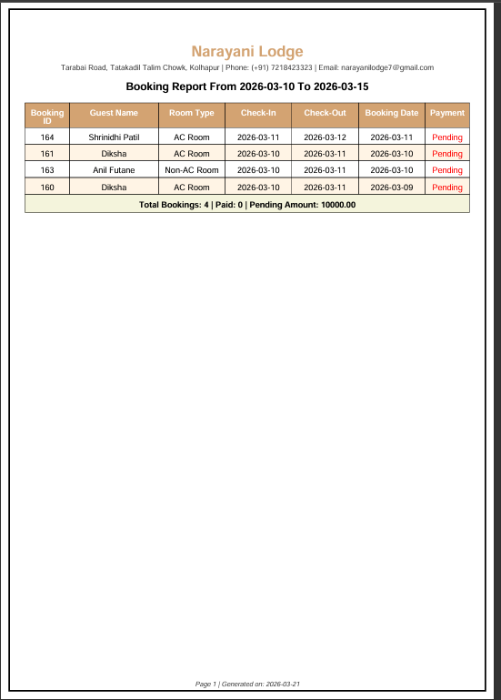

# 🏨 Narayani Lodge Website

## 📌 About Project
This is a hotel booking website developed using ASP.NET and SQL Server.  
Users can check room availability and send booking requests.  
Admin can manage rooms, customers, payments, and reports.

---

## 🚀 Features
- Room booking system  
- Check room availability  
- Admin dashboard  
- Customer management  
- Payment tracking  
- Report generation  

---

## 🛠 Technologies Used
- HTML, CSS, JavaScript  
- ASP.NET (C#)  
- SQL Server  

---

## 📸 Screenshots

  
  
  
  

---

## ▶️ How to Run
1. Open project in Visual Studio  
2. Connect SQL Server database  
3. Run project  

---

## 👩‍💻 Author
Diksha Futane
